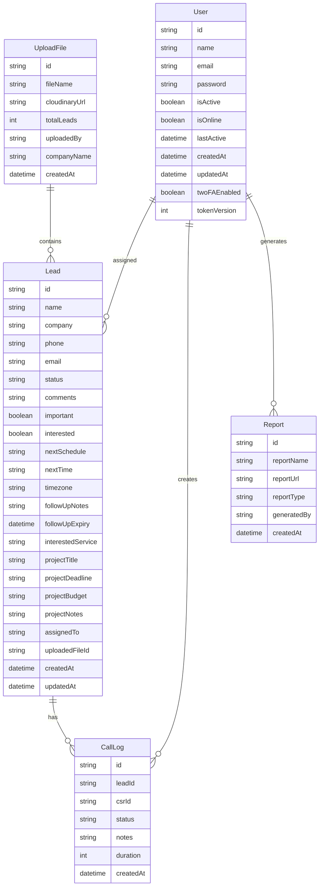
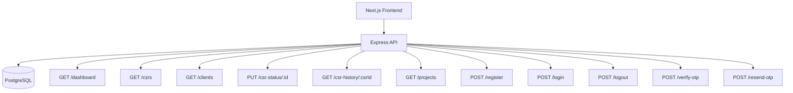
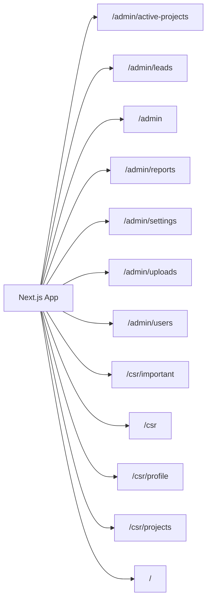

# CRM Dashboard — Auto Documentation

> Generated automatically. Do not edit manually.

## Project Structure
```txt
├── PROJECT.md
├── backend
│   ├── .env
│   ├── .gitignore
│   ├── package-lock.json
│   ├── package.json
│   ├── prisma
│   │   ├── migrations
│   │   │   ├── 20260520143742_init
│   │   │   │   └── migration.sql
│   │   │   ├── 20260520185508_upload_system
│   │   │   │   └── migration.sql
│   │   │   ├── 20260520190735_enterprise_crm
│   │   │   │   └── migration.sql
│   │   │   ├── 20260522144955_add_project_and_service_fields
│   │   │   │   └── migration.sql
│   │   │   ├── 20260522153312_make_report_user_optional
│   │   │   │   └── migration.sql
│   │   │   ├── 20260522195906_add_is_active_to_user
│   │   │   │   └── migration.sql
│   │   │   ├── 20260601152157_init_with_online_status
│   │   │   │   └── migration.sql
│   │   │   ├── 20260601153240_add_online_status
│   │   │   │   └── migration.sql
│   │   │   ├── 20260601185145_add_company_name
│   │   │   │   └── migration.sql
│   │   │   ├── 20260602194741_add_2fa_token_version
│   │   │   │   └── migration.sql
│   │   │   └── migration_lock.toml
│   │   ├── schema.prisma
│   │   └── seed.ts
│   ├── prisma.config.ts
│   ├── src
│   │   ├── app.ts
│   │   ├── config
│   │   │   ├── cloudinary.ts
│   │   │   └── db.ts
│   │   ├── controllers
│   │   │   ├── auth.controller.ts
│   │   │   ├── csr.controller.ts
│   │   │   ├── report.controller.ts
│   │   │   ├── reportUpload.controller.ts
│   │   │   ├── upload.controller.ts
│   │   │   └── user.controller.ts
│   │   ├── middleware
│   │   │   ├── auth.middleware.ts
│   │   │   ├── role.middleware.ts
│   │   │   └── upload.middleware.ts
│   │   ├── routes
│   │   │   ├── admin.routes.ts
│   │   │   ├── auth.routes.ts
│   │   │   ├── csr.routes.ts
│   │   │   ├── report.routes.ts
│   │   │   ├── reportUpload.routes.ts
│   │   │   ├── upload.routes.ts
│   │   │   └── user.routes.ts
│   │   ├── server.ts
│   │   └── utils
│   │       ├── hash.ts
│   │       ├── jwt.ts
│   │       └── sessions.ts
│   └── tsconfig.json
├── frontend
│   ├── .gitignore
│   ├── AGENTS.md
│   ├── CLAUDE.md
│   ├── README.md
│   ├── app
│   │   ├── admin
│   │   │   ├── active-projects
│   │   │   │   └── page.tsx
│   │   │   ├── components
│   │   │   │   ├── Announcement.tsx
│   │   │   │   ├── Navbar.tsx
│   │   │   │   ├── OverviewChart.tsx
│   │   │   │   ├── PerformanceChart.tsx
│   │   │   │   ├── Quickactions.tsx
│   │   │   │   ├── Recentactivity.tsx
│   │   │   │   ├── Sidebar.tsx
│   │   │   │   ├── StatsCards.tsx
│   │   │   │   ├── Systemhealth.tsx
│   │   │   │   ├── TopPerformer.tsx
│   │   │   │   └── Welcome.tsx
│   │   │   ├── leads
│   │   │   │   └── page.tsx
│   │   │   ├── page.tsx
│   │   │   ├── reports
│   │   │   │   └── page.tsx
│   │   │   ├── settings
│   │   │   │   └── page.tsx
│   │   │   ├── uploads
│   │   │   │   └── page.tsx
│   │   │   └── users
│   │   │       └── page.tsx
│   │   ├── csr
│   │   │   ├── components
│   │   │   │   ├── ActivityCard.tsx
│   │   │   │   ├── AnnouncementBanner.tsx
│   │   │   │   ├── CSRNavbar.tsx
│   │   │   │   ├── CSRSidebar.tsx
│   │   │   │   ├── CSRStats.tsx
│   │   │   │   ├── DailyCalls.tsx
│   │   │   │   ├── DailyTasks.tsx
│   │   │   │   ├── ImportantCalls.tsx
│   │   │   │   ├── LinkTabs.tsx
│   │   │   │   ├── LinksTable.tsx
│   │   │   │   ├── MonthlyProjects.tsx
│   │   │   │   ├── PendingTasks.tsx
│   │   │   │   ├── QuickActions.tsx
│   │   │   │   ├── RecentActivity.tsx
│   │   │   │   ├── StatusBadge.tsx
│   │   │   │   ├── WelcomeHeader.tsx
│   │   │   │   └── types.ts
│   │   │   ├── important
│   │   │   │   └── page.tsx
│   │   │   ├── page.tsx
│   │   │   ├── profile
│   │   │   │   └── page.tsx
│   │   │   └── projects
│   │   │       └── page.tsx
│   │   ├── favicon.ico
│   │   ├── globals.css
│   │   ├── layout.tsx
│   │   └── page.tsx
│   ├── eslint.config.mjs
│   ├── lib
│   │   └── api.ts
│   ├── middleware.ts
│   ├── next-env.d.ts
│   ├── next.config.ts
│   ├── package-lock.json
│   ├── package.json
│   ├── postcss.config.mjs
│   ├── public
│   │   ├── globe.svg
│   │   ├── images
│   │   │   ├── image.png
│   │   │   └── logo.jpeg
│   │   ├── next.svg
│   │   ├── vercel.svg
│   │   └── window.svg
│   └── tsconfig.json
├── generate-docs.js
├── package-lock.json
└── package.json
```

## Database ERD


## Backend API Flow


## Frontend Pages


## API Routes
| Method | Path | File |
|--------|------|------|
| `GET` | `/dashboard` | `backend/src/routes/admin.routes.ts` |
| `GET` | `/csrs` | `backend/src/routes/admin.routes.ts` |
| `GET` | `/clients` | `backend/src/routes/admin.routes.ts` |
| `PUT` | `/csr-status/:id` | `backend/src/routes/admin.routes.ts` |
| `GET` | `/csr-history/:csrId` | `backend/src/routes/admin.routes.ts` |
| `GET` | `/projects` | `backend/src/routes/admin.routes.ts` |
| `POST` | `/register` | `backend/src/routes/auth.routes.ts` |
| `POST` | `/login` | `backend/src/routes/auth.routes.ts` |
| `POST` | `/logout` | `backend/src/routes/auth.routes.ts` |
| `POST` | `/verify-otp` | `backend/src/routes/auth.routes.ts` |
| `POST` | `/resend-otp` | `backend/src/routes/auth.routes.ts` |

## Frontend Routes
- `/admin/active-projects`
- `/admin/leads`
- `/admin`
- `/admin/reports`
- `/admin/settings`
- `/admin/uploads`
- `/admin/users`
- `/csr/important`
- `/csr`
- `/csr/profile`
- `/csr/projects`
- `/`
